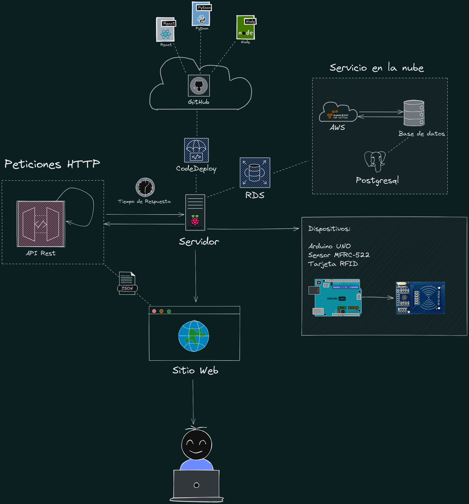
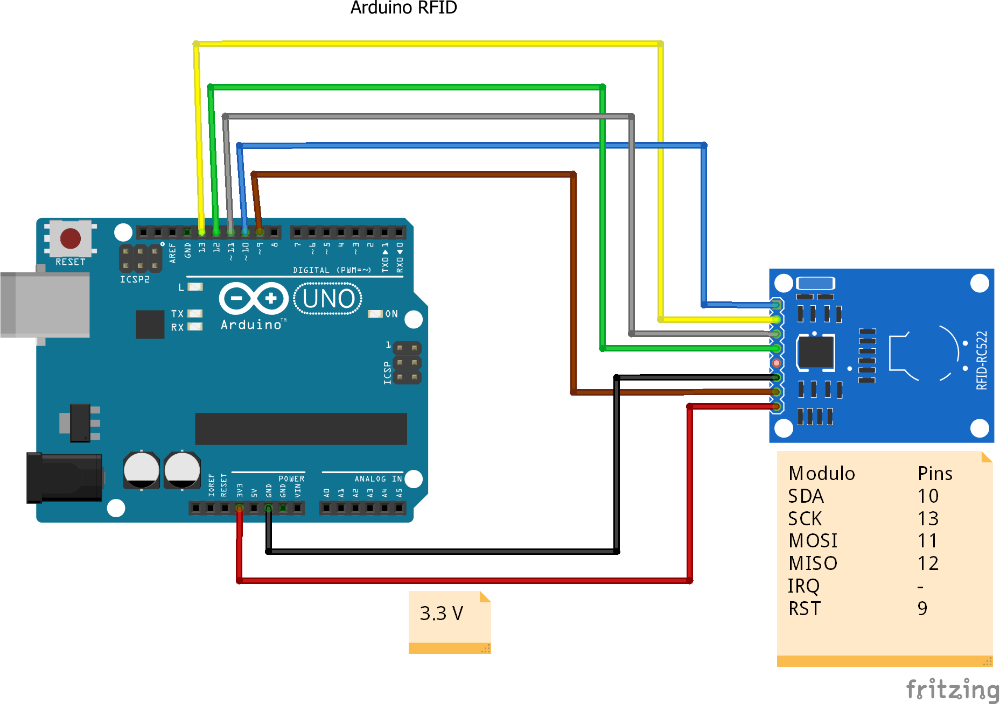
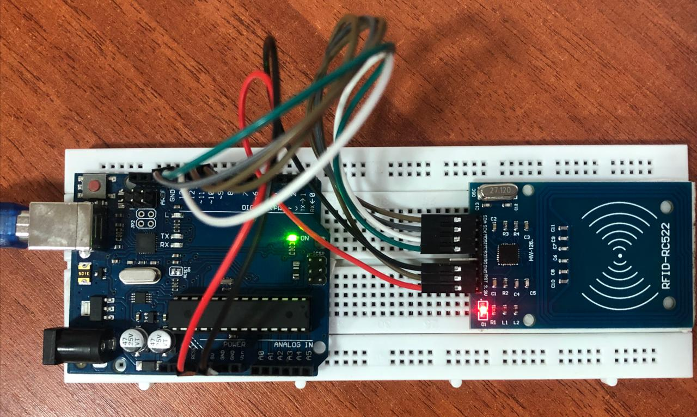

# Sistema de Ingreso y Asistencia Mediante Sensores 📡

Este proyecto es una aplicación web que permite el registro de asistencia de los estudiantes de la Fundacion Universitaria de popayan, mediante el uso de un sensor RFID y una Raspberry Pi 3.


## Tabla de Contenido 📄
1. [Arquitectura](#architecture)
2. [Instalación](#installation)
3. [Modo de Uso](#usage)
4. [Base de Datos](#database)
5. [Tecnlogias](#technologies)
6. [Autores](#authors)


## Arquitectura 🛠️
### Diseño de la Arquitectura ✒️
<!-- img -->


### Componentes Hardware 📌
- Raspberry Pi 3
- Arduino UNO
- Sensor MFRC-522 o Modulo RFID-RC522
- Tags RFID

### Esquema de Conexión 🔖
<!-- img -->


## Instalación 🔧
### Requisitos del proyecto 🪛
- Python 3.10
- Arduino IDE
- XAMPP(para pruebas locales)
- AWS (para despliegue en la nube)
- Node.js
- Raspberry Pi 3
- Sensor RFID-RC522
- Arduino UNO
- Tags RFID

### Pasos de Instalación 🪜
1. Construir el esquema de conexión
<!-- img -->



## Modo de Uso 📋

1. El estudiante se acerca al sensor RFID y coloca su tarjeta.
2. El sensor RFID envia la información de la tarjeta al Arduino.
3. El Arduino envia la información de la tarjeta al Raspberry Pi.
4. Si la tarjeta esta relacionada con un estudiante, debe validar la información de la tarjeta con la base de datos, además confirmar si el estudiante pertenece a dicha clase.
5. Luego se muestra la información del estudiante en la pantalla del docente, y se registra la asistencia en la base de datos.


## Base de Datos 💽


## Tecnlogias 🧰
En este proyecto se usaron las siguientes tecnologias:
* [Raspberry Pi 3](https://www.raspberrypi.org/products/raspberry-pi-3-model-b/): Version 3 de la Raspberry Pi.
* [PostgreSQL](https://www.postgresql.org/): Sistema de gestión de base de datos relacional.
* [Python](https://www.python.org/): Version 3.10.7
* [React](https://reactjs.org/): Version 18.2.0
* [Django](https://www.djangoproject.com/): Version 4.1.0
* [TailwindCSS](https://tailwindcss.com/): Version 3.1.8
* [Arduino](https://www.arduino.cc/): Version 2.0.0
* [Fritzing](https://fritzing.org/): Version 0.9.6

### Contribuciones 🖇️

```bash
# Materia: Creditos Libres II
$ Manuel Esteban Erazo
$ Jose Domingo Aranda Calambas
$ Jhon Leon
```
***